# Cairn user guide

> **This is a first draft, and it will be revised.** It was written from the app's own guide cards and checked against the published app screen by screen, but nobody outside the project has used it yet. If a step here does not match what you see, or something is missing, please say so: the Contact button in the app, or an issue on this repository.

Cairn is a study companion for anyone crossing into a new field. It is one web page and one file: the page is the app, and the file is your deck of cards, which stays on your device. This guide starts with getting going and with the app itself, then takes the five sections one at a time, using the same words as the guide cards inside every deck. A short section on troubleshooting closes it.

**Contents**

1. [Start](#1-start)
2. [The app](#2-the-app)
3. [The course](#3-the-course)
4. [Field Map](#4-field-map)
5. [Research](#5-research)
6. [Further Reading](#6-further-reading)
7. [Cairns](#7-cairns)
8. [Working with an AI assistant](#8-working-with-an-ai-assistant)
9. [When something goes wrong](#9-when-something-goes-wrong)

**About the pictures.** Most come from the sample pack on this repository (`cairn-example-pack.json`), a made-up field called Trailcraft, so you can open the same pack and see the same screens. Some come from the author's own deck, because it holds a real course and a real field map: the syllabus, the cards under a reading, the linked term, the export dialog and all of the Field Map. Those screens will look different in your deck.

**One word before you start.** The panel on the left is called the **Cairn Map** on screen. This guide, like the guide cards, calls it **the spine**: the whole deck as a tree, down the left side.

---

## 1. Start

### Open the app

Use Cairn in your browser at <https://mrponcedeleao.github.io/cairn/>, or save `index.html` from this repository onto your computer and open it from there. They are the same page, and both work offline once open. **On a phone, use the web address:** the optional cloud voice has to reach a speech service, and a phone opening the page as a local file will not let it.

### The welcome: three doors

With no deck open, the welcome offers three doors.

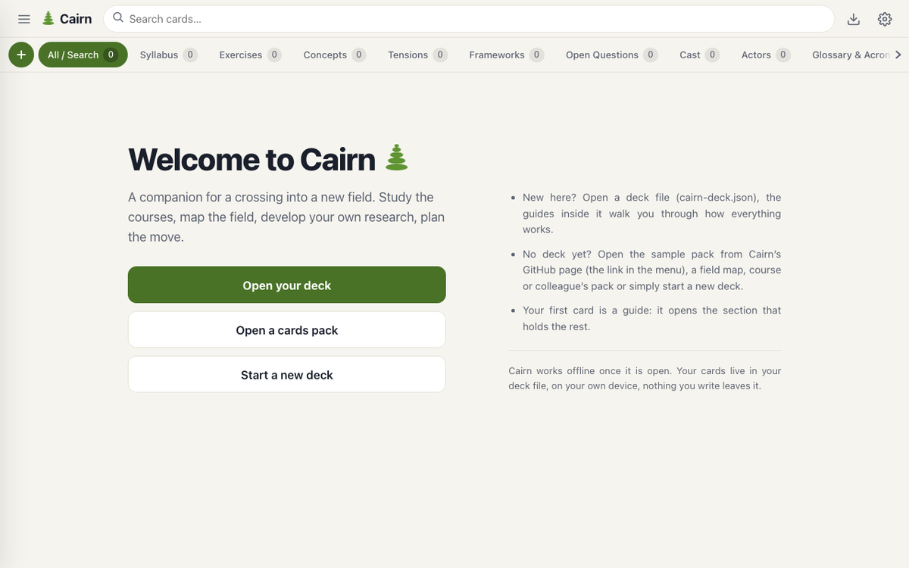

*With no deck open, the welcome offers three doors.*

- **Open your deck** opens your `cairn-deck.json`. This is the deck you keep: everything you write goes into it.
- **Open a cards pack** reads a pack a colleague or a course sent you, without adding it to your deck. Use it to look before you commit.
- **Start a new deck** begins an empty one.

If you have no deck yet, download one of the two packs from [`packs/`](https://github.com/mrponcedeleao/cairn/tree/main/packs/): the **starter deck** (the six guides and nothing else) or the **sample pack** (the same six guides plus one of every kind of card, filled in for a made-up field). The [README](https://github.com/mrponcedeleao/cairn#readme) explains which to choose.

To **keep** the sample pack as your deck rather than just look at it: rename the file to `cairn-deck.json`, then use **Open your deck**. Write your own cards beside the samples and delete the samples as you go. Every one of them is tagged `example`, so searching for **example** finds exactly the ones still to go.

### Find your way

When a deck opens, All / Search lists the app guide first. Each section's guide then heads its own section's cards, in the order of the spine.

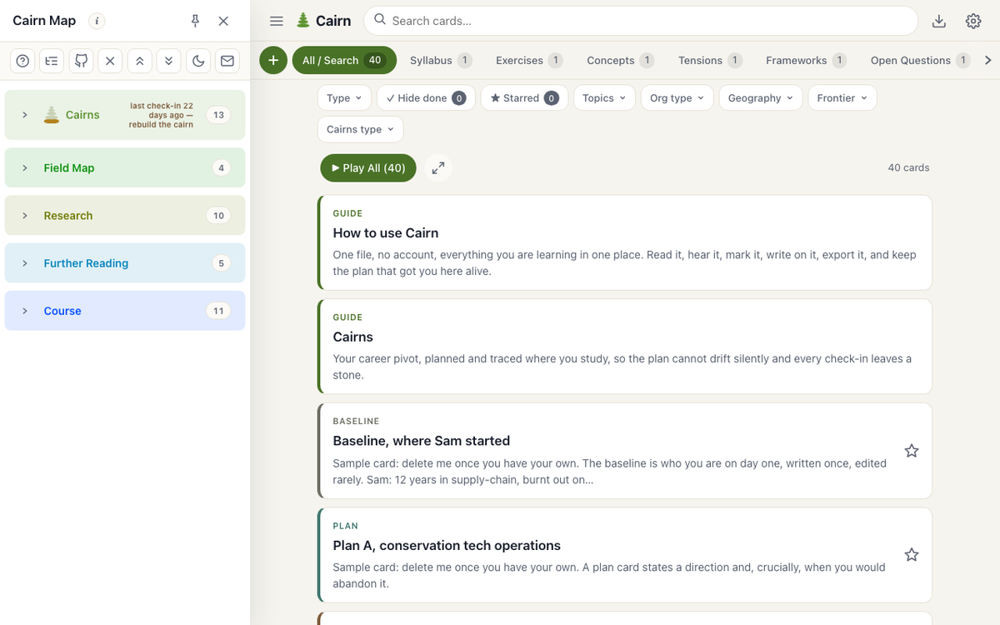

*A deck opens on the app guide; each section's guide heads its own section. The spine on the left is the whole deck as a tree, with a count on every row.*

The spine is the whole deck as a tree: Cairns, Field Map, Research, Further Reading, then each course by unit. Every row shows a count, and the little arrows open and close and remember how you left them. Click a section's name and its cards open, starting with its guide. The menu button (≡) at the top left opens and closes the spine.

The tree icon in the spine's toolbar opens the **structure cards**: the guides, the course units, the research topics and the reading shelves. That is the skeleton the content hangs on, so you can add a unit or a topic without touching a single content card.

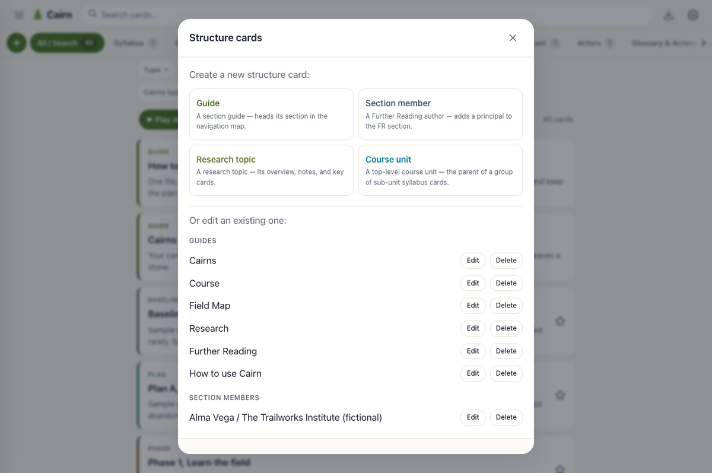

*The tree icon opens the structure cards: create a Guide, a Section member (an author's shelf), a Research topic or a Course unit, or edit the ones you have.*

---

## 2. The app

### Read a card, then hear it

Every card has a front (the one thing to remember) and a back (everything else). In a list you see fronts; tap a card, or press Space, to see the rest. On a laptop, the left and right arrow keys step through cards, and the bar under an open card does the same, with **Shuffle** to take them in a random order.

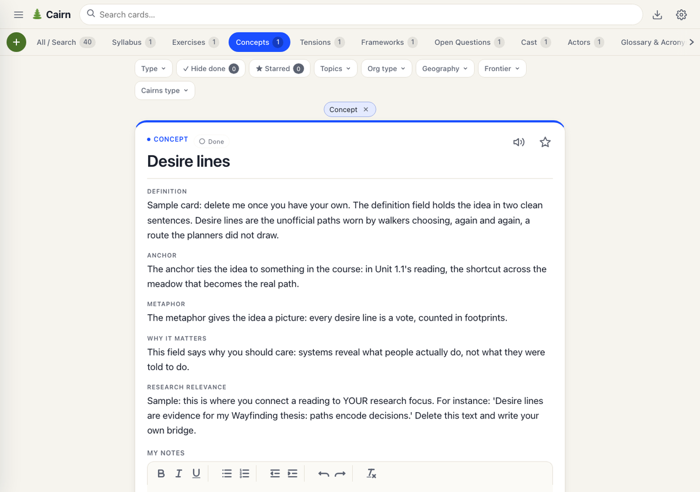

*The back of a card holds everything else. The speaker reads it aloud, field by field.*

Press the **speaker** on any card and it reads aloud in a sensible order, field by field, with the field names spoken as cues. Press **Play All** above any list and it reads the whole list in the order you see it, with a mini-player and lock-screen controls on a phone, so a unit or a research topic becomes a walk.

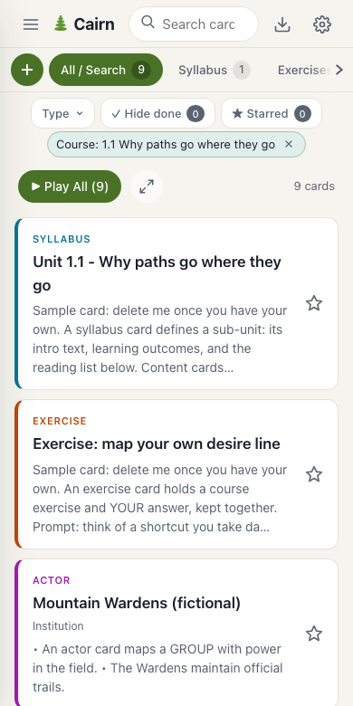

*On a phone, Play All reads the whole list in the order you see it.*

### Choose the voice

Open **Settings** (the gear at the top right). Under Read-aloud, choose **This device's voices** or **My Google Cloud voice**.

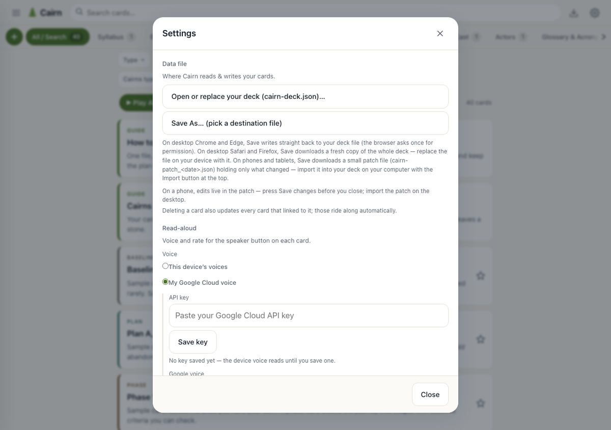

*Settings: your device's voices, or a cloud voice with your own key, which stays on your device.*

For the cloud voice:

1. Paste your own Google Text-to-Speech key and press **Save key**.
2. Further down the same box, press **Test**. It tells you plainly if something is wrong.
3. A counter there shows the characters sent this month. A card read twice is not paid for twice, because the clips are kept.

The key stays on your device. If the cloud voice fails, reading falls back to the device voice with a short notice, so it never goes silent. The same box holds the device voice you prefer, the reading **rate**, and the **pause between cards** in Play All.

### Search everything, filter anything

The search box reads every field on every card, your notes included: definitions, the crux of a tension, an institution's details, a check-in. Your exercise answers are the one thing it leaves out. Results appear as you type. Then narrow by type, by star, by hiding what you have marked done, and in the Field Map and Cairns by their own filters.

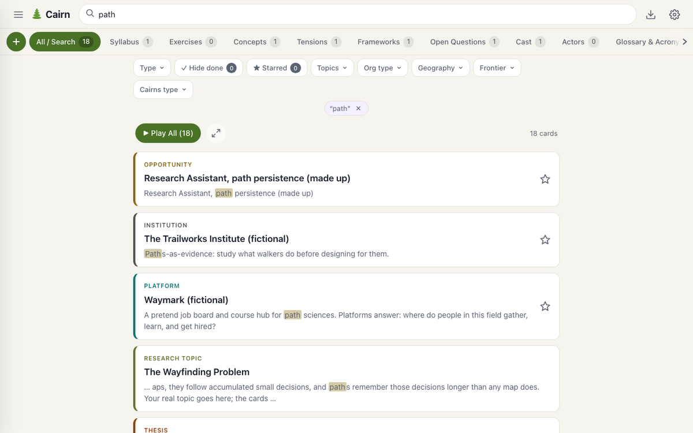

*Search reads every text field; each filter, the search included, is a chip you can remove.*

**Back** takes you the way you came, from a linked card to the card that linked it and from a card to its list, and only ever offers places that still exist.

### Everything links

Any concept, glossary term, person or framework named inside a card becomes a link where it appears: hover for the definition, click to go. Related cards sit at the foot of every card. Acronyms expand themselves the first time they appear.

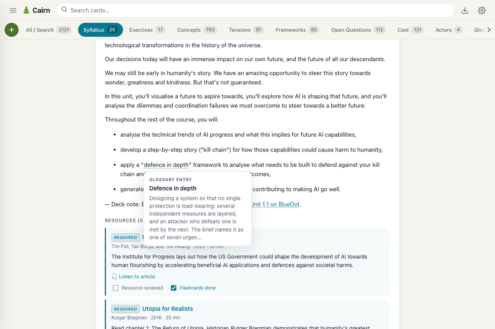

*A term named anywhere becomes a link: hover for its definition.*

### Make it yours

Star what matters. Mark cards done and hide them. Write notes on every card with a small formatting toolbar; they are searchable and read aloud with the card. Answer exercises in the card itself. **Delete** is at the foot of an open card; the app asks first, and a deleted card can be undone until you save.

To add a card:

1. Press the green **+** in the tab row.
2. Choose the card type.
3. Fill in the fields. The form shows only the fields that type has, each with an ⓘ that explains it.
4. Set **Appears in** to place the card where it belongs, then save.

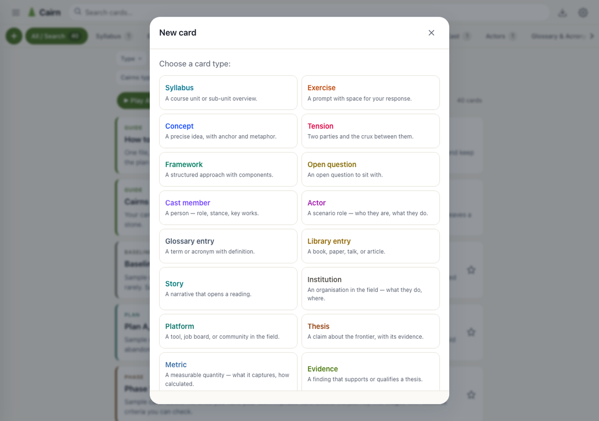

*The green + asks for a card type first, then shows only that type's fields.*

### Put a card where it belongs

A card is in the wrong place when you find it under a section or unit it does not belong to, or cannot find it where you expected. Search finds it by any word in it, wherever it landed, and the card's back says where it appears.

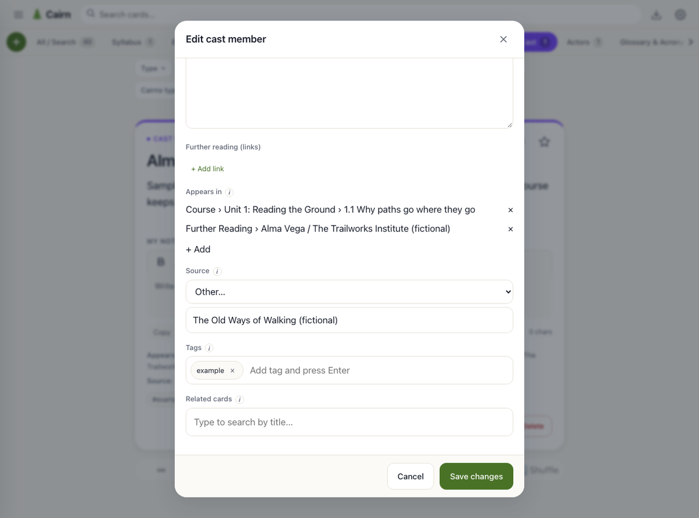

*Appears in, inside Edit: this card lives in two places, and + Add gives it another.*

To move it:

1. Open the card and press **Edit**.
2. Set **Appears in**: a course unit, a Further Reading shelf, or a research topic.
3. Save. The spine counts update.

Institutions and platforms file themselves in the Field Map and need nothing.

### Take it with you

Any branch of the tree can be exported as a Word file or Markdown: a whole course, one unit, one research topic, one shelf, one card. Open **Settings** and choose **Export from the deck…**, or press **Export…** on a single card.

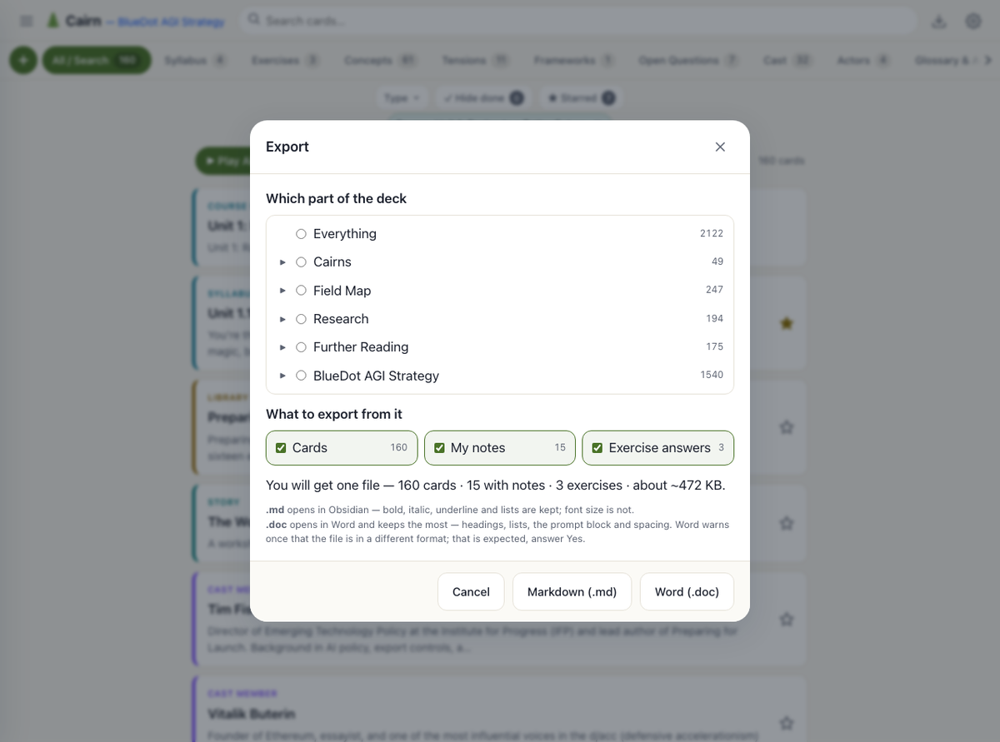

*Choose which part to export, then what goes with it. Each tick is counted before you press the button.*

Three ticks decide what goes in: the **cards**, your **notes**, and your **exercise answers**, each counted before you press the button. Untick Cards to export only what you wrote. Markdown (`.md`) opens in any notes app; Word (`.doc`) keeps the most formatting, and Word warns once that the file is in a different format, which is expected. Goals with a target date, and opportunities with a deadline, export to your calendar. The whole deck exports as a JSON backup (JSON is the plain text format the deck file is written in) from **Settings**, **Export full deck as JSON backup**.

### Save, at your desk and on the go

A marker shows when there is unsaved work: a pill on desktops, a chip on touch screens.

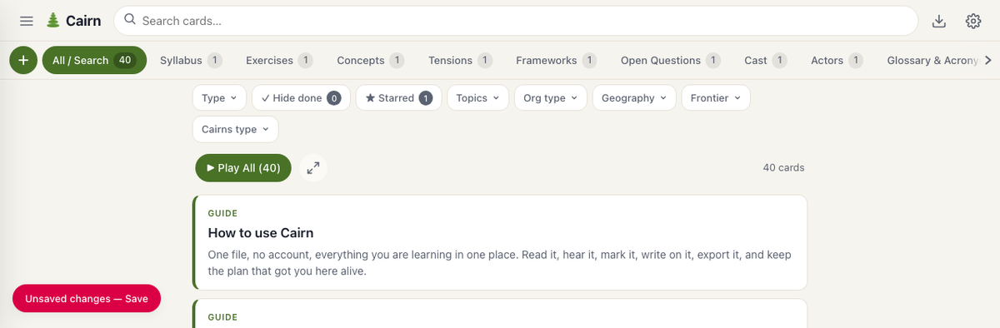

*The pill says there is unsaved work; click it to save.*

- **Chrome or Edge on a computer:** Save writes straight back to your file (the browser asks once for permission).
- **Safari or Firefox on a computer:** Save downloads a fresh copy under the same name; replace the old file with it.
- **On a phone:** Save writes a small patch of just what changed, `cairn-patch_<date>.json`. Import that patch into the full deck on your computer and it merges. If the same card changed on both sides, the import names it by title and lets you choose.

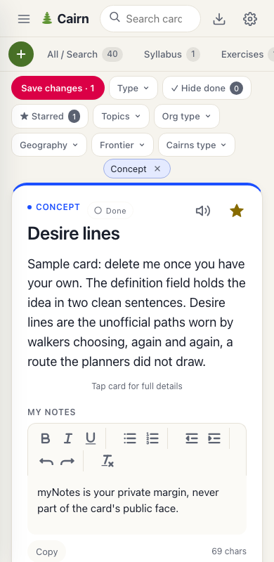

*On a phone, the chip counts your unsaved changes; Save writes them as a small patch file.*

If the browser is closed or crashes before you save, Cairn keeps what you had and offers **Recover** when you next open it. Anything still unrecovered also waits under **Settings**, **Data file**, as small *recover*, *download* and *discard* links; they appear only when there is something to recover.

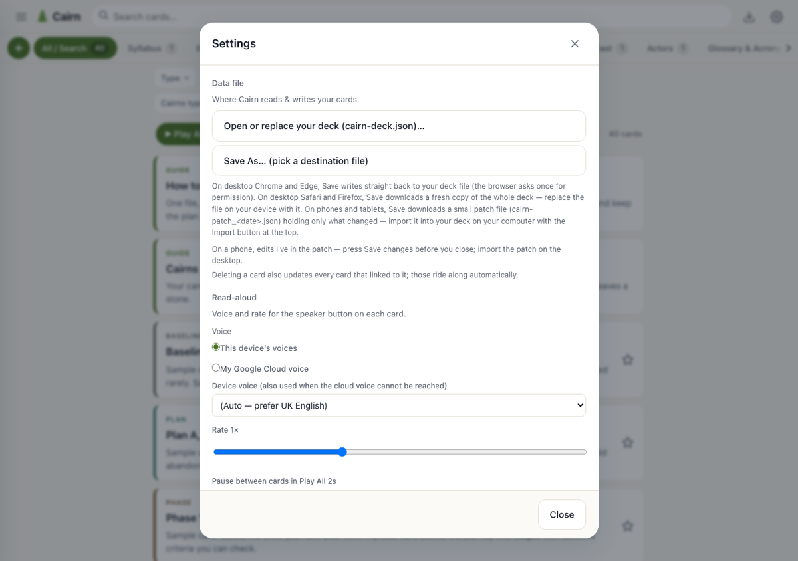

*Settings, Data file: open or replace your deck, and how Save behaves in each browser.*

### Grow it

Import a pack, a JSON file of cards someone made: a course, a field map, a shelf. Press **Import** (the arrow at the top right) and choose the file. **A card whose id you already have is replaced whole**, which is why an import never duplicates: read a pack before you import it.

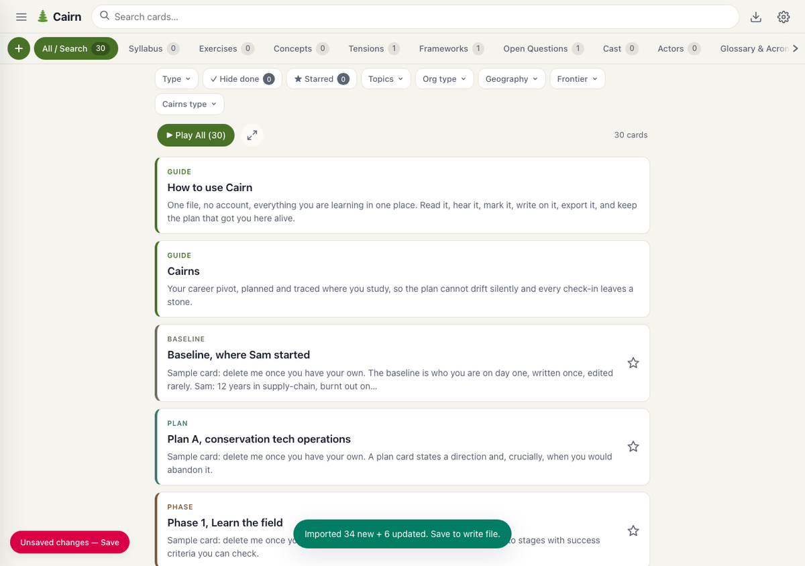

*Importing a pack merges by id and never duplicates: the notice says what was added and what was updated.*

The notice is the count to trust. *(In this draft's version of the app, the card count at the top can read low straight after an import, and catches up when the deck is next opened.)* Replacing a card by id is how you update one on purpose, and the one way to lose one by accident.

The spine's toolbar also holds **Cairn on GitHub**, where the packs and skills that exist are kept, and **Contact**, the envelope, which reaches the author.

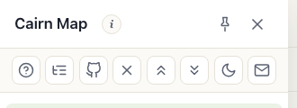

*The spine's toolbar: help, the structure cards, Cairn on GitHub, and Contact.*

---

## 3. The course

A course as a study companion: units and sub-units as the syllabus lays them out, each reading with what it is and how long it takes, and the concepts, tensions, frameworks, people and stories each reading contains as cards of their own. It is the shape for any course you are taking: a university module, a professional certificate, a reading group.

### Walk the syllabus

Each unit is a row in the spine. Open a sub-unit and its syllabus card lists the readings, marked **Required**, **Optional**, or **Added by author** when the deck's owner brought something in, with the link, the author, the time it takes, and a **Listen to article** link where an audio version exists.

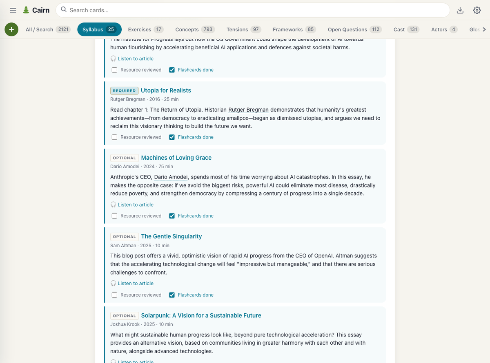

*A syllabus card lists the readings, with two ticks per reading to keep your place.*

Two small ticks per reading keep your place: **Resource reviewed**, and **Flashcards done** for when you have made your own flashcards from it (Cairn keeps the tick; the flashcards live wherever you make them).

### Learn the reading, not only the summary

Under each reading sit its cards: a concept with its definition, an anchor (the memorable hook), a metaphor and why it matters; a tension with both parties, their claims and the crux; a framework with when to use it; the people, called cast, with their stance and key works; a story; and the glossary, whose terms light up wherever they appear in the deck. The cards cluster under the reading they came from, automatically, by source.

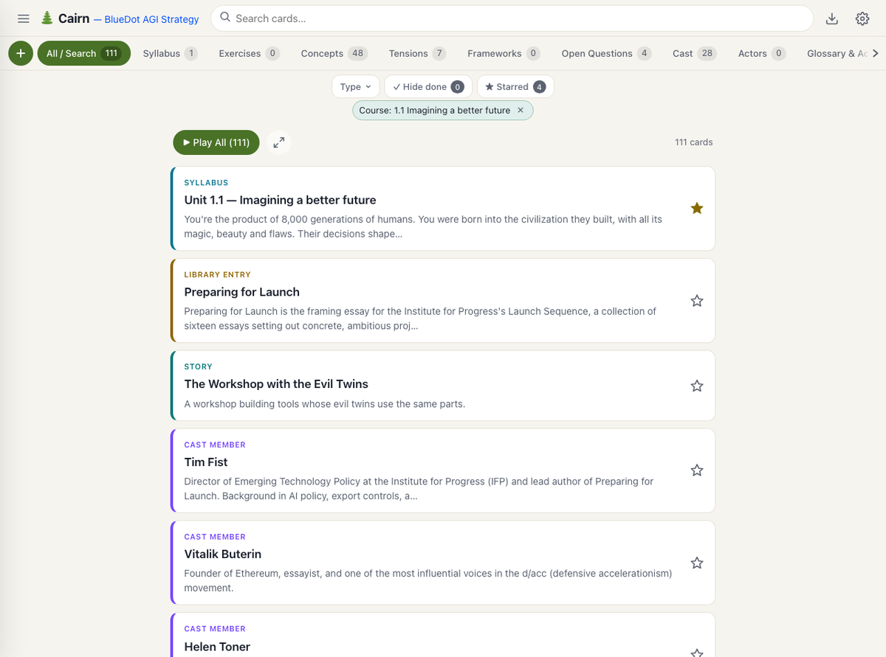

*A sub-unit's cards, gathered by the reading they came from: here a reading, then its story and its people.*

### Do the exercises in the card

Each exercise carries its prompt and a space for your answer, with formatting. Three status buttons above the title, Not started, Ongoing and Done, record where you are. On an exercise whose author left a structure, a **Use template** button fills it in; the one pictured has none. Your answers are yours: they are not searchable by default and they export only when you tick the box.

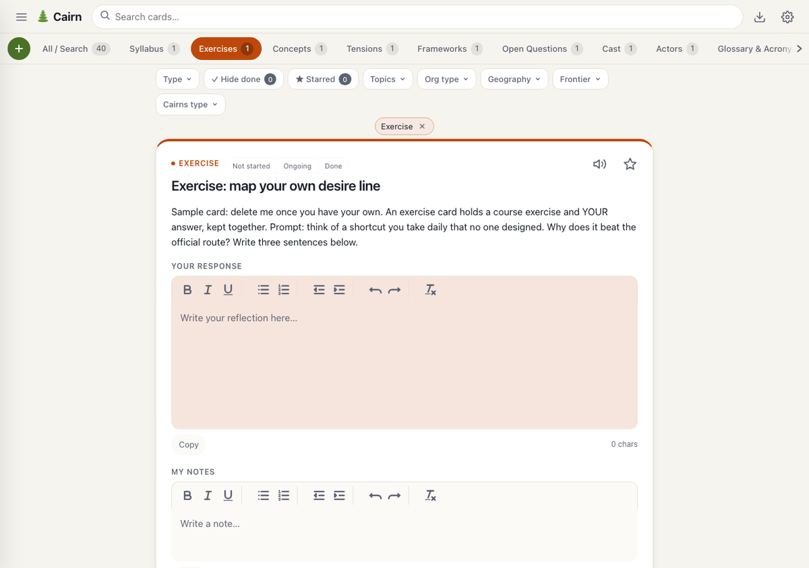

*An exercise holds its prompt and a space for your answer, with its status above the title.*

### Hear a unit, hand in your work

**Play All** on a sub-unit reads the syllabus, then each card, in order. The read-along toggle expands the list on screen in the same order.

To hand your work to a reviewer, export the course's exercises, every prompt with your answer under it, headed by unit, as a Word file (see [Take it with you](#take-it-with-you)). This is how a peer, a tutor or an AI reviewer sees exactly what you did.

Cards that bear on your research carry a **Research relevance** line, and the related-cards list takes you there. Star, done and hide done work here as everywhere: your progress is a filter, not a spreadsheet.

---

## 4. Field Map

A map of a field you are entering. Institutions (labs, institutes, funders, think tanks, companies) and platforms (courses, communities, job boards, tools), each as a card with the facts a newcomer needs and the judgement calls a newcomer cannot make: a safety stance, an openness rating, a work-mode note, a checked-on date, and a provenance line saying which of the organisation's own pages were read, and when.

### Find the door, and count them

In the **Table**, the **Open opps** column shows, for every organisation, how many of its opportunities are still actionable: open, rolling or upcoming. Closed, by invitation and not stated never count, because a door nobody has described is not an open door.

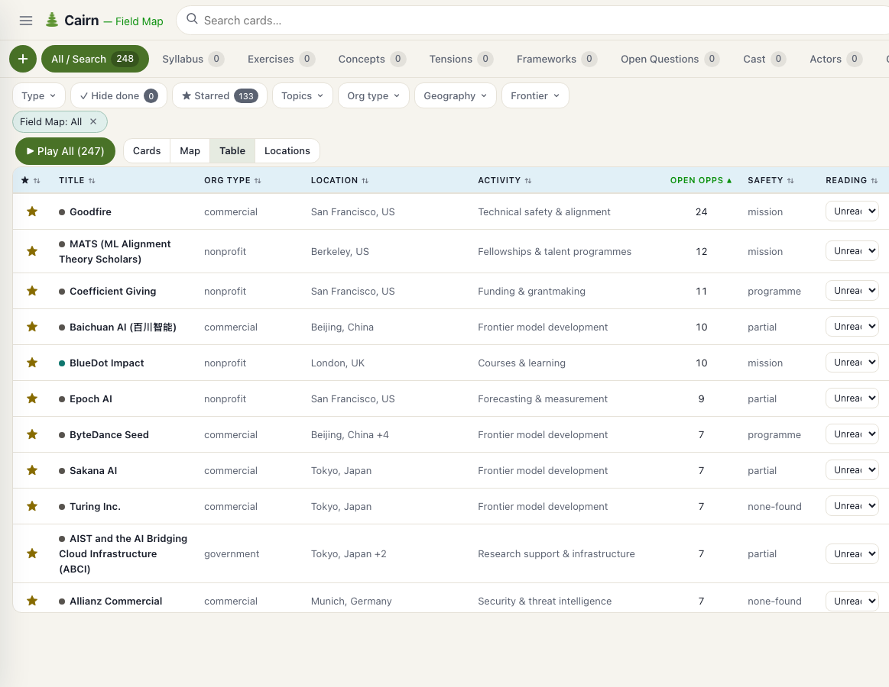

*The Open opps column counts the doors still open, per organisation.*

1. Filter first to the slice you care about: a topic, a region, a research frontier (one of the topics in your Research section).
2. Tap the **Open opps** header once for the most openings first; tap again for the fewest.
3. Track your own engagement (targeting, applied, in conversation) in the same row, and star what you are working towards.

### Four views of the same cards

**Cards**, to read one organisation at a time. **Map**, a world map with a pin per site, clustered when they overlap, coloured by the organisation's safety stance, dashed when the location is approximate; zoom with the wheel, a pinch or the buttons, and click a pin or a cluster to open the card. **Table**, every organisation as a row. **Locations**, the sites themselves, editable in place.

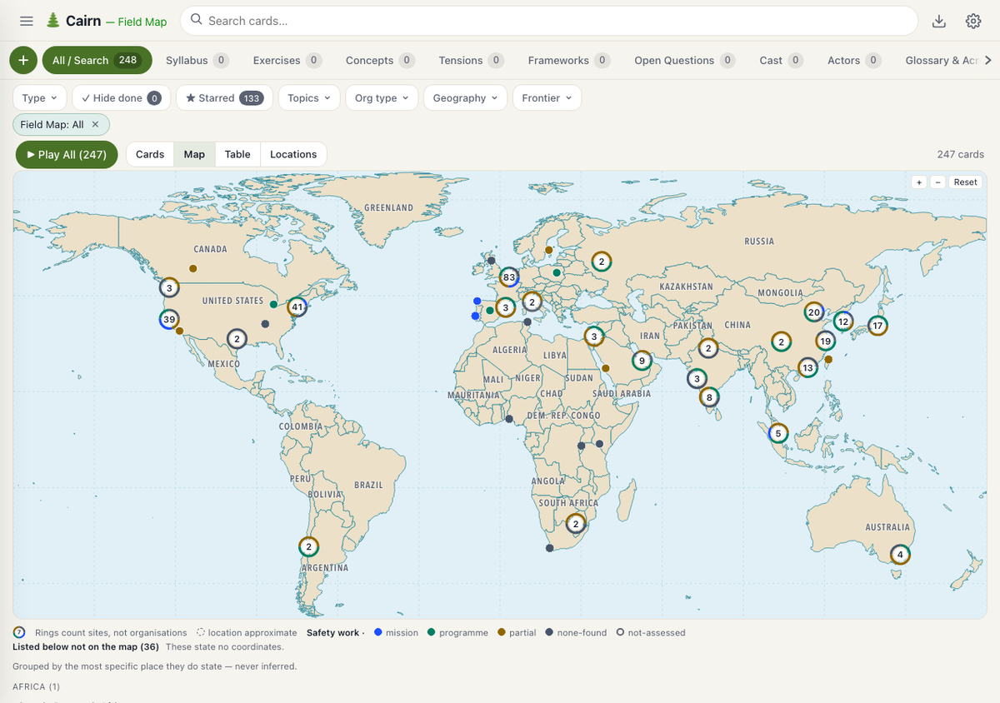

*A pin per site, rings counting sites, coloured by safety stance.*

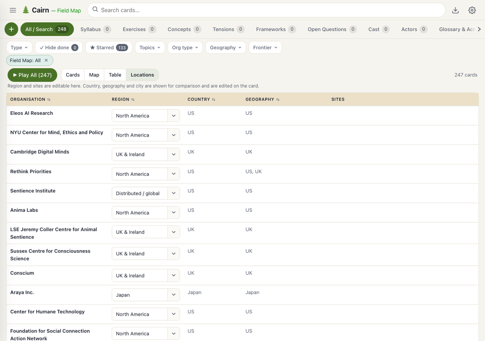

*The Locations view lists every organisation's region, country and sites.*

Filters apply to the map as much as to the list, so "remote-friendly funders in Europe interested in welfare" is three clicks and a look. An organisation that states no location has no pin: it is listed under the map instead, so check that list before trusting a map for a region.

### Read the badges before the prose

Safety stance (mission, programme, partial, none found, not assessed) with a note; openness (open, partial, closed); work mode (on-site to fully remote); eligibility; the date it was checked; and provenance, how the card was made. The badges are the difference between a directory and a map.

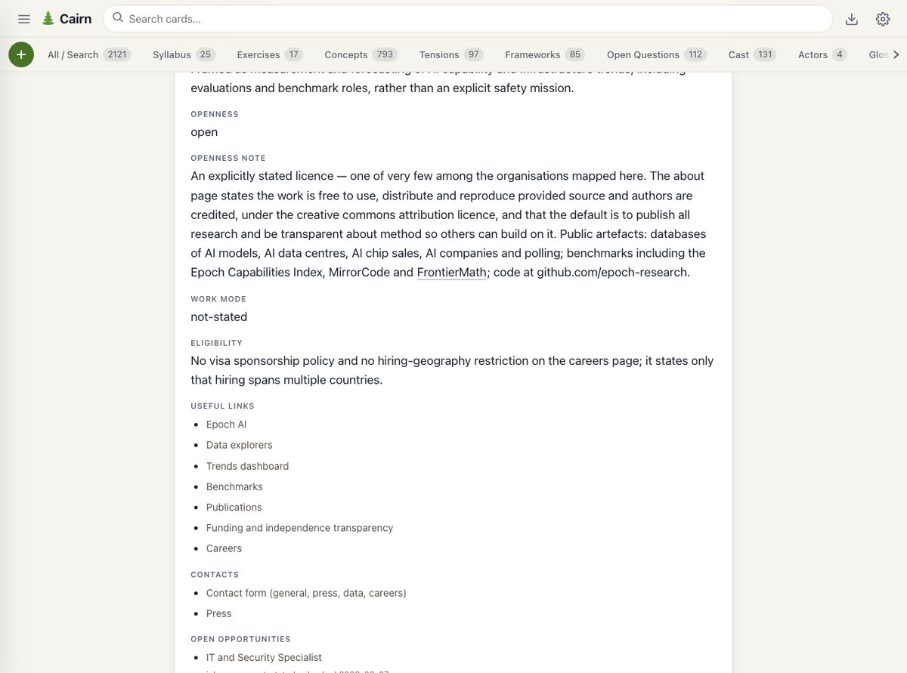

*An organisation's card carries its judgement calls, openness and work mode among them, before its links.*

Each opportunity is a row: kind, label, status, deadline, stipend, eligibility, work mode, and the date it was seen.

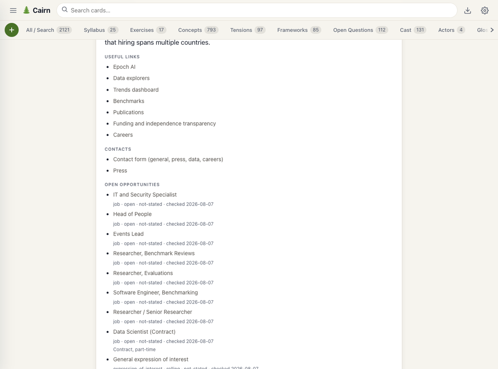

*Each opportunity is a row: kind, status, and the date it was checked.*

### Go in, come back, take a briefing

Open an organisation, follow a link on its card, press **Back** and you are on the organisation again. Press it again and you are back on the table or the map, filters intact. To take a briefing with you, export Institutions, one activity bucket, or the platforms as a Word file: a dated field briefing with links and badges.

---

## 5. Research

A scaffold for thinking in public before you publish. Research topics (frontiers) are the structure, and under each sits a working set: a thesis stated and defined, the metrics that would test it, the evidence for and against with its limitations, the open questions you are sitting with, the tensions between positions, the frameworks and stories that carry the ideas.

### Walk a frontier

Open a topic in the spine. Its topic card introduces it, then the theses, then everything under them. **Play All** reads a frontier aloud in order; on a walk, that is a draft you are listening to.

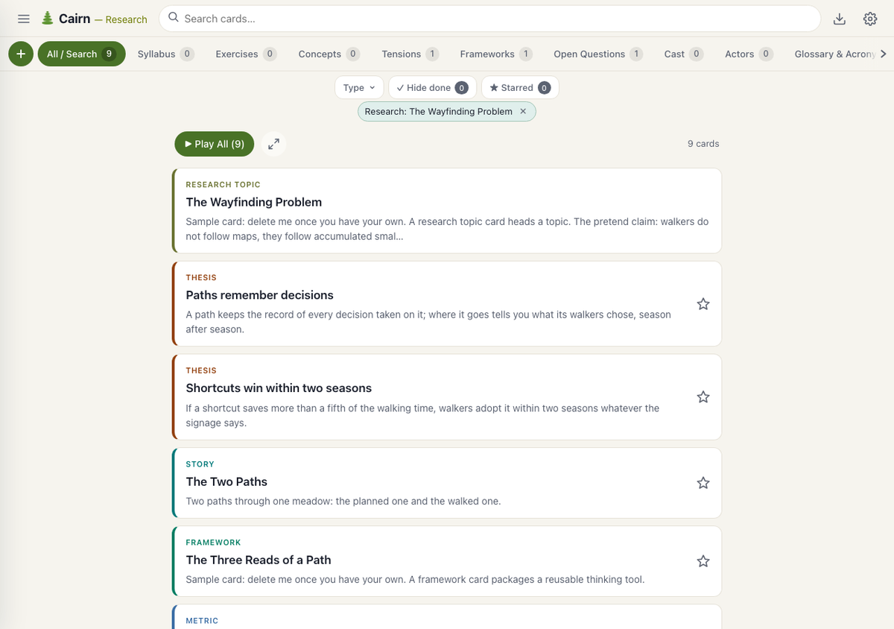

*A frontier opens on its topic card, then its theses and everything under them.*

### Say how sure you are, on the card

Every thesis, metric and evidence card carries a **maturity** badge (Intuition, Developing, Evidenced, Contested), a **reading status** (Unread, Skimmed, Read, Verified, Original) and a **provenance** line: own work, developed with AI, from literature. Evidence carries its source type and its limitations beside its finding. A stranger can see at a glance what is a hunch and what is a result, and so can you, six months later.

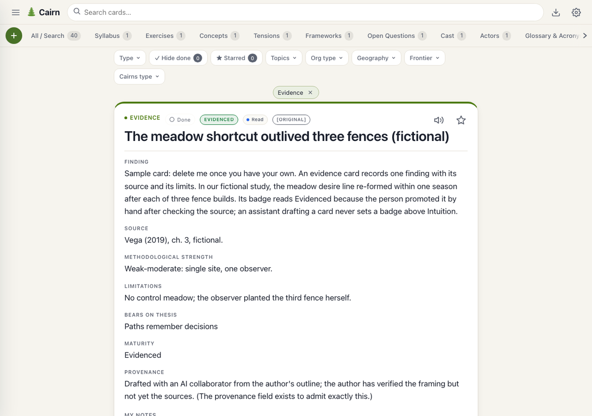

*Evidence carries its maturity, its reading status and its limitations beside the finding.*

You promote a card's maturity by hand, when you have earned it.

### Draft with it, keep the questions

Export a frontier, or one thesis with its evidence, as a Word file; the badges come with the text, so a reviewer sees the claim and its maturity together. References (label and link) on a thesis, metric or evidence card print as further reading. An open question card has the question, why you are sitting with it, your current thinking and a status: Open, Sitting with, Provisionally answered.

---

## 6. Further Reading

The shelf beyond any course: reading organised by principal, the author or voice, with each work as a library card and the chapters, ideas and arguments inside it as cards of their own.

### Shelves by voice

Each principal, the author or voice a shelf is for, is a row in the spine: a structure card (called a **Section member** in the app) with a description and its own resource list, so an author's works sit together.

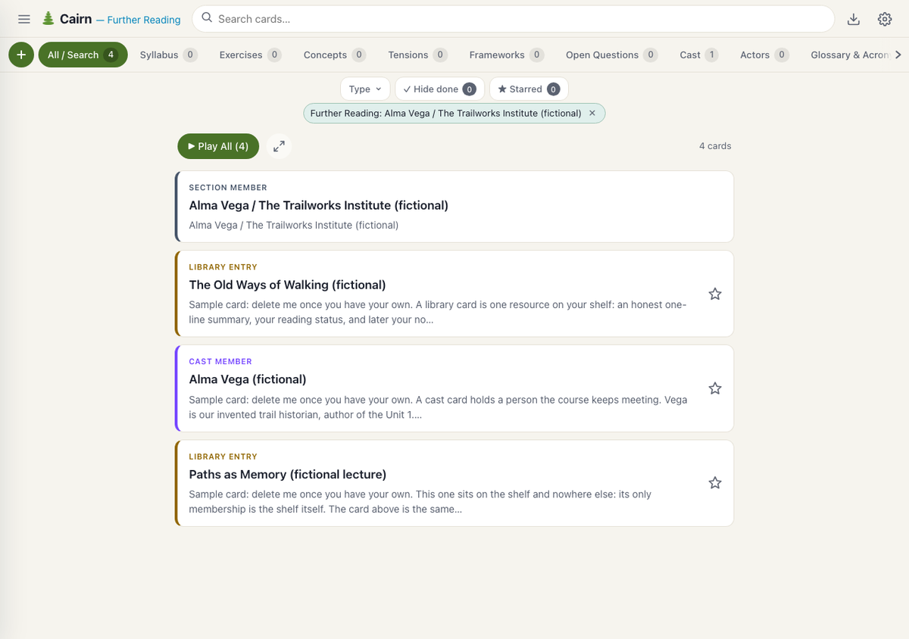

*A shelf gathers one author's works.*

Library cards carry a status (To read, Reading, Read), a media type, a summary in your words and a why-it-matters line. Search finds the sentence you half remember, in your notes or on the card.

### Let a reading live in two places

A book chapter that a course also assigns appears in both, on its author's shelf and in the unit, as one card and not a copy. The card's back says where it appears, and **Appears in** is where you set it (see [Put a card where it belongs](#put-a-card-where-it-belongs)).

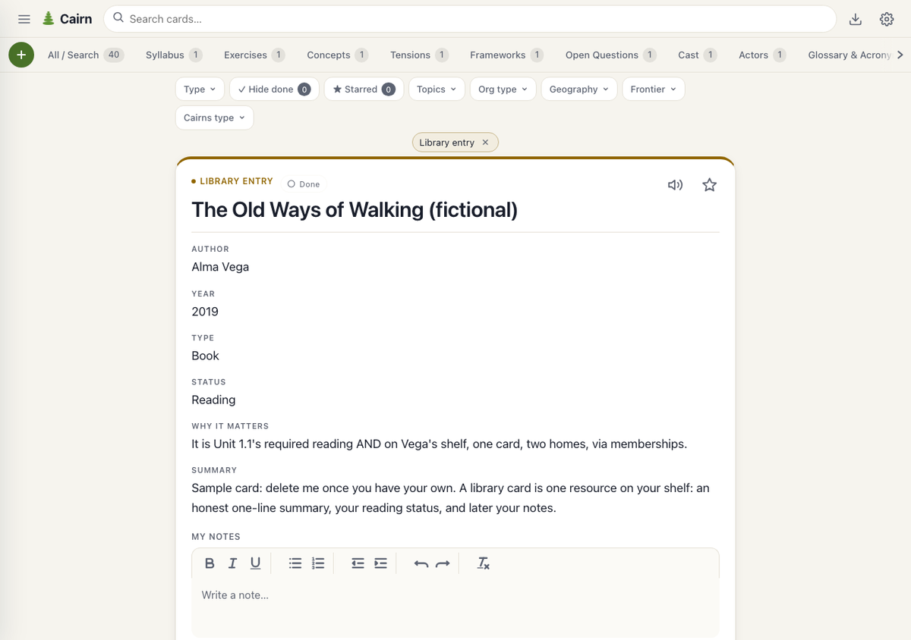

*One card, two homes: a required reading that also sits on its author's shelf.*

**Play All** on a principal reads the works and their cards in order: an author's thinking as an audiobook of your own notes.

---

## 7. Cairns

Your career plan as cards, next to the work it is for: a baseline, plans A, B and Z, phases, goals, opportunities with a reasoned decision, uncertainties with the cheapest test that would settle them, boundaries, and check-ins. Cairns is yours and lives in your file. Nothing leaves your device unless you export it, and **Cairns can be exported like any other section, and is inside every full JSON backup**, so choose what you export before you share it. Every picture here comes from the sample pack, whose person is made up.

### A heartbeat, not a reminder

The section header shows how long since your last check-in and turns amber, then red, *rebuild the cairn*, when you are overdue against the cadence you set. A due-soon strip lists goals and opportunities in the next fortnight, and each one exports to your calendar with a click.

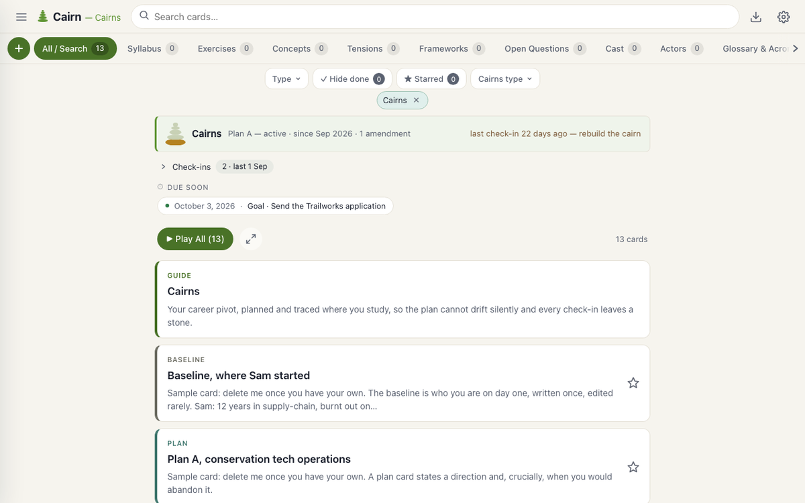

*The header shows how long since the last check-in and says when the cairn needs rebuilding; goals due soon sit beneath it.*

### Plans that admit change

Edit a plan substantively and the app asks whether to log an amendment: one dated line, kept on the card.

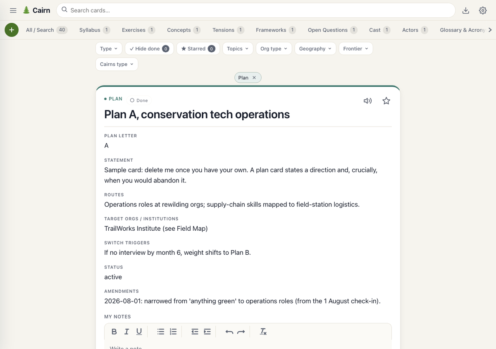

*A plan keeps its amendments on the card, dated.*

### Decide on the record, test your doubts

An opportunity card holds the role, the link, the deadline, and your decision (pursuing, applied, skipped, later, expired) with the reasoning. Skipping well is a result, and it stays.

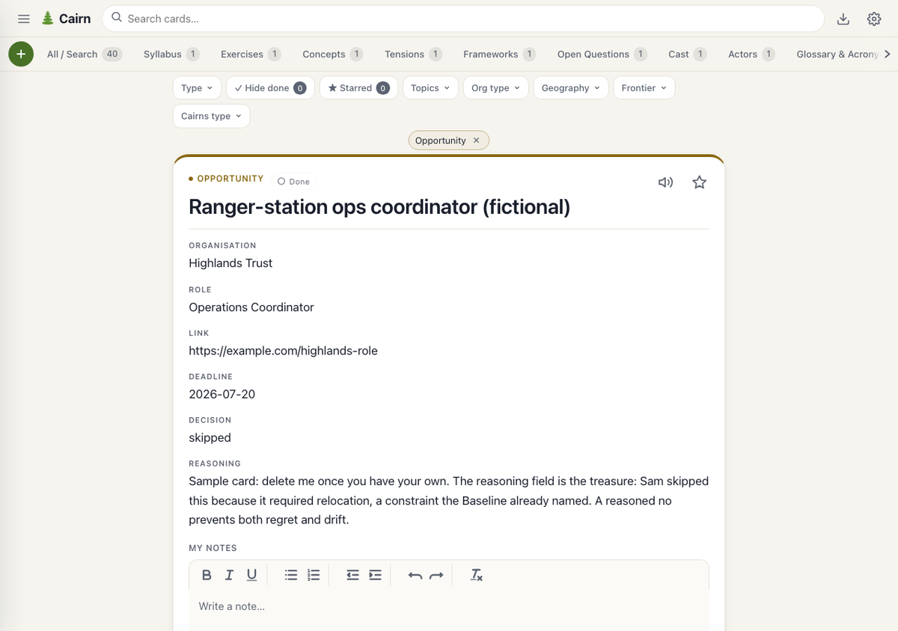

*A decision is kept with its reasoning, skipped ones too.*

An uncertainty is a question, why it matters, the cheapest test, and its status. The check-in cadence is set on the Cairns guide card (Edit). The **Cairns type** filter shows one kind at a time; pick one and a status filter appears for that type.

### Write the check-in

The same questions every time: what moved, what stalled, the drift check, amendments made, sustainability, next priority. Dated, listed by month. Written honestly, the check-ins are the story of the crossing.

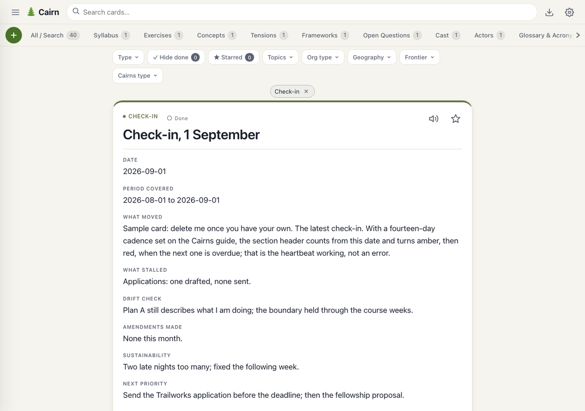

*A check-in asks the same questions every time.*

---

## 8. Working with an AI assistant

You can build cards by hand, or with an AI assistant. Either way, give the assistant three things:

1. **The section's guide card**, so it knows what the section is for.
2. **The card form's field names with their ⓘ text**, so it knows what each field holds.
3. **The source you want carded:** a syllabus page, a folder of notes, an organisation's About page, your own documents.

Ask for cards in the deck's JSON shape, honest about what it drafted and what it could not verify, and read every one before you import.

The [skills](https://github.com/mrponcedeleao/cairn/tree/main/skills/) do the same with less setting up. A skill is a folder of instructions an assistant reads first, so the cards it drafts follow the same conventions as the guides. Each one ships a check to run on a pack before you import it, and the check prints three kinds of line:

- **ERROR:** the app would reject the card, file it nowhere, or overwrite something of yours. Fix it.
- **WARN:** a claim about your deck or the app, for you to look at and decide on. **It is not an instruction to rewrite your own words**, and an assistant that rewrites them to clear a warning has done the wrong thing.
- **NOTE:** a field that belongs to you, such as your notes or your answers. Never something for an assistant to fix.

The check ends by saying what it did not look at, because a clean run is not a statement that the cards are right.

---

## 9. When something goes wrong

- **The deck does not open by itself.** Use **Open your deck** on the welcome screen. Some browsers will open a deck sitting next to the page and some will not; the button works in all of them.
- **Save downloads a file instead of writing to yours.** That is Safari and Firefox on a computer: replace your old file with the new one. In Chrome or Edge, Save writes back once you allow it the first time.
- **You saved on a phone and your computer does not show it.** The phone wrote a patch, `cairn-patch_<date>.json`. Import it into the full deck on your computer and save there.
- **The cloud voice says nothing, or falls back.** Press **Test** in Settings; it says what is wrong. On a phone, open Cairn from its web address, not from a saved file.
- **A card is somewhere unexpected.** Search for it, open it, and check **Appears in** (see [Put a card where it belongs](#put-a-card-where-it-belongs)).
- **You want to share some of your cards.** Export the part you mean (Settings, **Export from the deck…**). The full JSON backup holds everything, Cairns included, so send that only to yourself.

---

*Cairn is open: the app is MIT, the card packs are CC BY 4.0. Questions, corrections and confusions are all welcome through the Contact button in the app, or an issue on this repository.*
